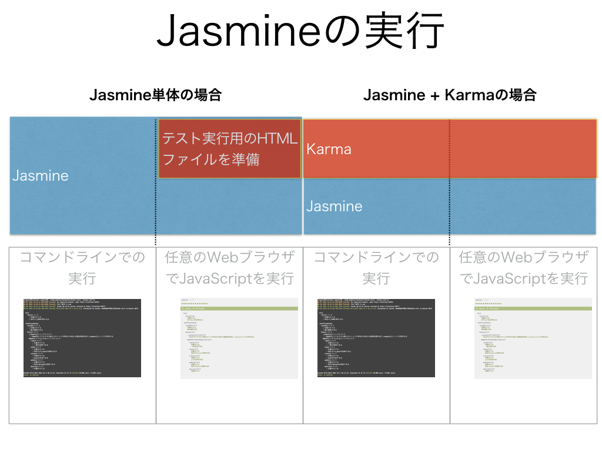

## Jasmineとは？

今回はJasmineとKarmaを組み合わせたテストの実行環境を構築してあるのですが、簡単にJasmineについて説明しておきます

### テストを書く上で必要な構成要素

テストを書くといっても、色々な構成要素から成り立ってるのでその点について説明しておきます

上記で簡単に絵にしてみたのですが

- テスティングフレームワーク
  - テストを書く上での基盤となるもの
- アサーション用のライブラリ
  - テスト結果が期待された値かどうかを評価する仕組み 
- モック・スタブ用のライブラリ
  - 単体テストで必要となるパーツを擬似的に再現するための仕組み
  - この説明は[RSpec でテストを作るのに役立つ「モック/スタブ」のシンプルな説明](http://morizyun.github.io/blog/rspec-model-controller-ruby-rails/)から引用してます

という形になります

### Jasmineの特徴

上記で簡単にですが、テストを書いて実行する上での構成要素について触れましたが、これを踏まえてJasmineの特徴をまとめてみました

図解してるようにJasmineはオールインワンなテスティングフレームワークなので、基本的にはこれを導入することで一通りのことが行えるようになります。

個人的には、Ruby/RailsでRSpecを使ってテストを書く習慣がベースとしてあって、RSpecと似たような記法のJasmineは違和感がないのでずっと使ってます。

ただ、周囲にJavaScriptのテストに詳しい人がいて、かつ、その人がJasmine以外のものを使い慣れてるのならそちらを使っても良いかと思ってます。（最近はシンプルなpower-assertを使うのが流行りっぽいです）

### Jasmineの実行

ターミナル上でコマンドを実行することで、Jasmineを通じてテストが実行されますが、今回のサンプルでは、JasmineとKarmaを組み合わせたやり方を採用してるので、それぞれの位置づけについても簡単にまとめてみました

Jasmine単体でももちろんテストを実行することは出来ますし、今回のサンプルアプリのようにWebAPIとの通信処理のコードに対するテストを書く場合にはViewのレンダリングをする必要がないので、Karmaを利用する必要は無いのかもしれません。

今回は以下の理由によりKarmaを使うことにしてます

- 個人的に最近Karmaを使って作業することが多くすでにKarmaを実行させるための設定ファイルが元々あった
  - それを流用することで環境構築の手間が減らせる
- Jasmine単体でWebブラウザ上でのJavaScriptを実行させるためのHTMLを準備するのはまた違った準備が必要になるので作業上それなりに手間がかかる
