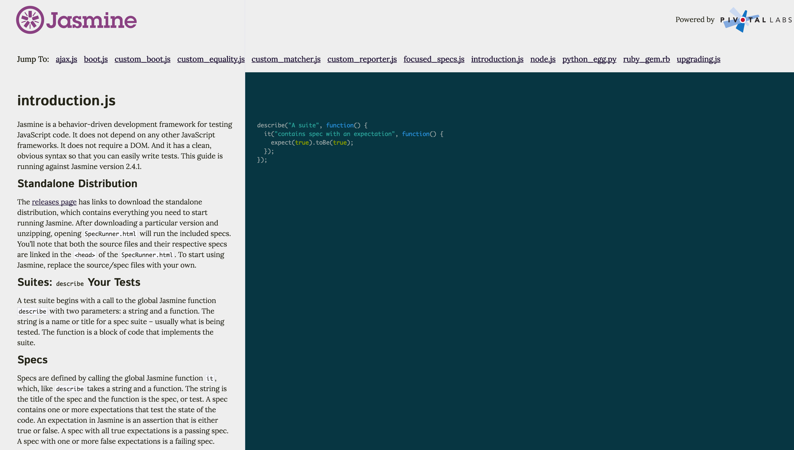

## Jasmineの特徴

上記で簡単にですが、テストを書いて実行する上での構成要素について触れましたが、これを踏まえてJasmineの特徴をまとめてみました

### 概念図

### 説明

図解してるようにJasmineはオールインワンなテスティングフレームワークなので、基本的にはこれを導入することで一通りのことが行えるようになります。

英語ですが以下のようにドキュメント自体もしっかりと整備されています。

上記ドキュメントを見てもらうとわかりますが、テストされた値の評価をする記法が豊富なので、初めてJavaScriptの単体テストを書く時にどこから手を付けて良いのか戸惑いやすいかもしれません。

### Jasmineを採用する時の参考情報

個人的には、Ruby/RailsでRSpecを使ってテストを書く習慣がベースとしてあって、RSpecと似たような記法のJasmineは違和感がないのでずっと使ってます。

もしも周囲にJavaScriptのテストに詳しい人がいて、かつ、その人がJasmine以外のものを使い慣れてるのならそちらを使っても良いかと思ってます。（最近はシンプルなpower-assertを使うのが流行りっぽいです）
