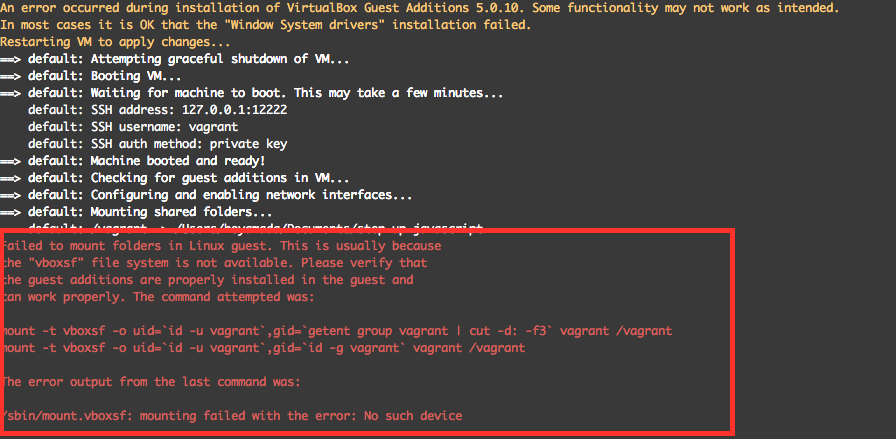

# Vagrant環境構築中にエラーになる場合

## 症状

vagrant upした後に、以下のように共有フォルダのマウント作業途中で失敗してしまうことがあります。


```sh
Installing Virtualbox Guest Additions 5.0.10 - guest version is 5.0.6
Verifying archive integrity... All good.
Uncompressing VirtualBox 5.0.10 Guest Additions for Linux............
VirtualBox Guest Additions installer
Removing installed version 5.0.10 of VirtualBox Guest Additions...
Removing existing VirtualBox non-DKMS kernel modules[  OK  ]
Copying additional installer modules ...
Installing additional modules ...
Removing existing VirtualBox non-DKMS kernel modules[  OK  ]
Building the VirtualBox Guest Additions kernel modules
Building the main Guest Additions module[FAILED]
(Look at /var/log/vboxadd-install.log to find out what went wrong)
Doing non-kernel setup of the Guest Additions[  OK  ]
Installing the Window System drivers
Could not find the X.Org or XFree86 Window System, skipping.
An error occurred during installation of VirtualBox Guest Additions 5.0.10. Some functionality may not work as intended.
In most cases it is OK that the "Window System drivers" installation failed.
==> default: Checking for guest additions in VM...
==> default: [vagrant-hostsupdater] Checking for host entries
==> default: Configuring and enabling network interfaces...
==> default: Mounting shared folders...
    default: /vagrant => /Users/xxxxxx/Documents/node/step-up-javascript
Failed to mount folders in Linux guest. This is usually because
the "vboxsf" file system is not available. Please verify that
the guest additions are properly installed in the guest and
can work properly. The command attempted was:

mount -t vboxsf -o uid=`id -u vagrant`,gid=`getent group vagrant | cut -d: -f3` vagrant /vagrant
mount -t vboxsf -o uid=`id -u vagrant`,gid=`id -g vagrant` vagrant /vagrant

The error output from the last command was:

/sbin/mount.vboxsf: mounting failed with the error: No such device
```

### 参考までに私の手元の環境での画面キャプチャ



## 対応方法

[詳しいことは以前Qiitaにまとめてます](http://qiita.com/h5y1m141@github/items/553f559160ec30a872d6)が解決方法を抜粋して以下記載しておきます

### 仮想マシンにsshしてカーネルのインストールをする

```sh
vagrant ssh
```

として、SSHします。その後

```sh
sudo yum -y install kernel
```

と入力します。すると以下のようにターミナル上でインストール作業の進捗が表示されるので**完了しました!** の文字が出るまで待ちます

```sh
読み込んだプラグイン:fastestmirror
Loading mirror speeds from cached hostfile
 * base: ftp.jaist.ac.jp
 * extras: ftp.jaist.ac.jp
 * updates: ftp.jaist.ac.jp
〜途中省略〜
依存性を更新しました:
  dracut.x86_64 0:033-360.el7_2               dracut-config-rescue.x86_64 0:033-360.el7_2
  dracut-network.x86_64 0:033-360.el7_2       kmod.x86_64 0:20-5.el7
  libgudev1.x86_64 0:219-19.el7_2.7           linux-firmware.noarch 0:20150904-43.git6ebf5d5.el7
  systemd.x86_64 0:219-19.el7_2.7             systemd-libs.x86_64 0:219-19.el7_2.7
  systemd-sysv.x86_64 0:219-19.el7_2.7

完了しました!
```

### 仮想マシンからログアウトして、仮想マシンの再起動を行う

```sh
vagrant halt
vagrant up
```
