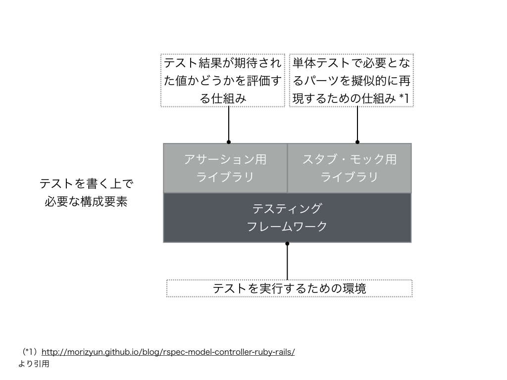

## テストを書く上で必要な構成要素

テストを書くといっても、色々な構成要素から成り立ってるのでその点について説明しておきます

### 概念図

### 個々の要素の説明

上記の概念図の個々の要素ですがそれぞれ以下のようになります

- テスティングフレームワーク
  - テストを書く上での基盤となるもの
- アサーション用のライブラリ
  - テスト結果が期待された値かどうかを評価する仕組み 
- モック・スタブ用のライブラリ
  - 単体テストで必要となるパーツを擬似的に再現するための仕組み
  - この説明は[RSpec でテストを作るのに役立つ「モック/スタブ」のシンプルな説明](http://morizyun.github.io/blog/rspec-model-controller-ruby-rails/)から引用してます

という形になります
