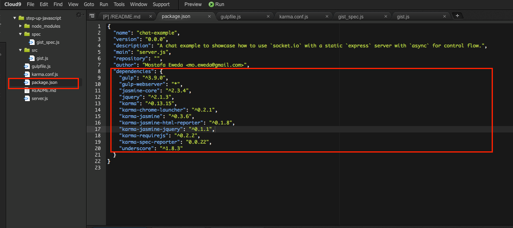
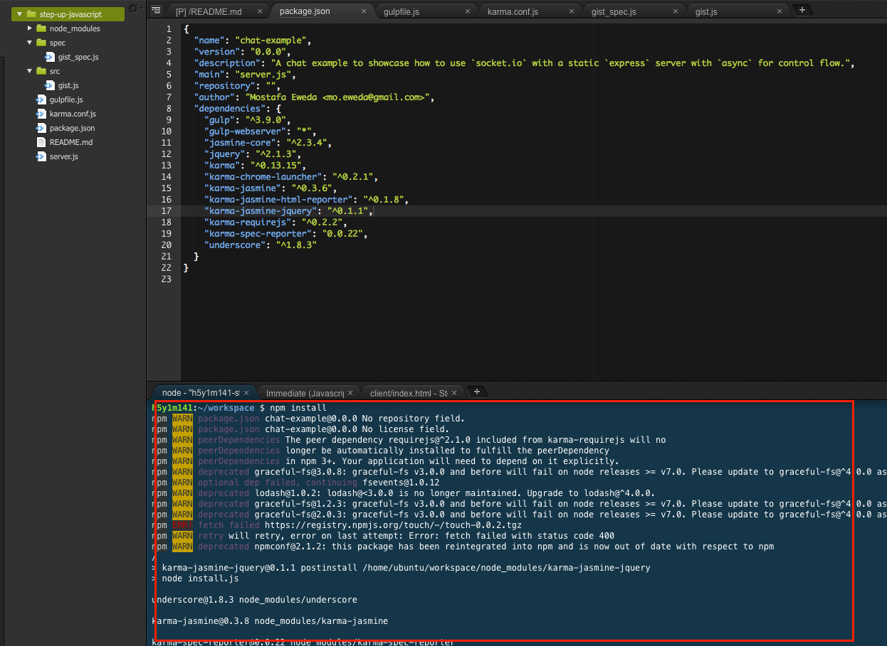
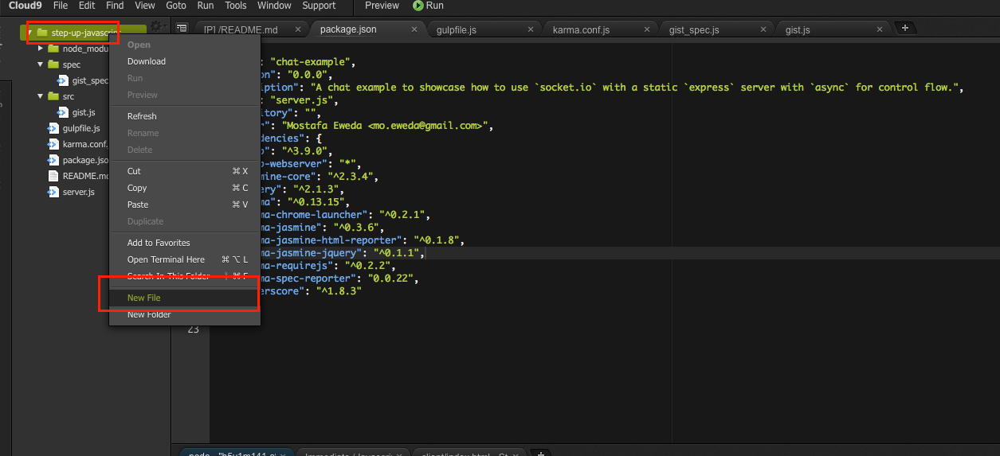

## Jasmine環境を構築する

Jasmineを使ったコードを書くための環境構築の手順を説明します

### Mac/Windows上でNode.jsの環境を利用する

お手元のMac/Windows上でNode.jsが利用できる環境が整ってる方は、今回の講座用の以下リポジトリをご自分のMac/Windows上の任意のディレクトリにgit cloneしてください。
https://github.com/h5y1m141/step-up-javascript

上記リポジトリにはpackage.json を作成してあります。それ以降の環境構築の作業は[Mac/Windows上でNode.jsの環境を利用する](../set_up_with_node.md)にまとめてありますのでそちらを御覧ください


### Cloud9を利用してる方

Mac/Windows上でNode.jsの環境を構築したことが無い方にはこちらの環境を利用をオススメしてます。Cloud9を初めて利用する方はまずは[Cloud9というクラウド上の環境を利用する](..//set_up_cloud9.md)を参考に初期設定をしてください

上記設定をした上で、さらに

- Jasmineのモジュールをインストールするためにpackage.jsonを修正
  - この作業を行うことでJasmineが利用できるようになります。
- Cloud9固有の問題を考慮してテストランナーのKarmaの設定ファイルを作成
- server.jsの修正

という作業を追加で行いますので、順番に説明します


#### package.jsonの修正

Cloude9の初期設定が完了すると画面左側のメニューにpackage.jsonというファイルが自動的に生成されています。このファイルをダブルクリックして開き**dependencies**のセクションを以下のようにします

```json
{
  "dependencies": {
    "async": "~0.2.8",
    "express": "~3.2.4",
    "socket.io": "~0.9.14",
    "gulp": "^3.9.0",
    "gulp-webserver": "*",
    "jasmine-core": "^2.3.4",
    "jquery": "^2.1.3",
    "karma": "^0.13.15",
    "karma-chrome-launcher": "^0.2.1",
    "karma-jasmine": "^0.3.6",
    "karma-jasmine-html-reporter": "^0.1.8",
    "karma-jasmine-jquery": "^0.1.1",
    "karma-requirejs": "^0.2.2",
    "karma-spec-reporter": "0.0.22",
    "underscore": "^1.8.3"
  }
}
```



書き換えが終わったら画面下部のターミナルに以下コマンドを入力します


```sh
npm install
```

npm installを実行した場合に以下のようにインストール中のモジュールが表示されます




上記コマンドを実行することで以下が自動的に行われます

- npmという仕組みを通じてpackage.jsonに記載されてる内容を読み取り、必要なモジュールをインストール
  - インストール対象のモジュールが、他のモジュールを別途必要とする場合でもそういう依存関係を自動的に解決してインストールしてくれます
  - インストール対象のモジュールが外部モジュールに依存してるものが多いとインストールに時間がかかる場合があります
- インストールされるモジュールを格納するためのディレクトリが生成される
  - node_modulesという名前です


#### Karmaの設定ファイルを作成

テストランナーとしてKarmaを利用してますが、Karmaの設定ファイルが必要になります。

左側のメニューの一番上のディレクトリを右クリック→New fileと選択して**karma.conf.js** という名前のファイルを作成します





作成したファイルに以下内容を記述します。

```javascript
module.exports = function(config) {
  config.set({
    basePath: '',
    frameworks: ['jasmine'],
    files: [
      'node_modules/jquery/dist/jquery.js',
      'src/**/*.js',
      'spec/**/*_spec.js'
    ],
    exclude: [],
    preprocessors: {},
    reporters: ['spec','html'],
    hostname: process.env.IP,
    port: process.env.PORT,
    colors: true,
    logLevel: config.LOG_INFO,
    autoWatch: true,
    browsers: [],
    singleRun: false,
    concurrency: Infinity
  });
};
```

Karmaの公式ドキュメントなどを見るとKarmaが利用するポート番号は9876がデフォルトとして設定されてるのですがCloud9で利用する時にはそのポートだとうまく利用できないようなので[Karmaの公式ドキュメントに記載のあるCloud9の設定](https://karma-runner.github.io/0.8/plus/Cloud9.html)を参考に

```
    hostname: process.env.IP,
    port: process.env.PORT,
```

という設定を追加してます。


#### server.jsの修正

Cloud9初期設定時にWebサーバー機能が自動的に利用できるようになってます。

ただ、初期設定だと**client** というディレクトリを参照するようになってますが、この講座の説明の都合上なるべくディレクトリ構成をシンプルにしたいため、プロジェクト直下のindex.htmlを参照するようにしたいのでserver.jsの修正します。


左側のメニューの一番下のserver.jsを開いて23行目にあるrouter.use()という内容を以下のように変更します。

```javascript
var router = express();
var server = http.createServer(router);
var io = socketio.listen(server);
// 以下を書き換える
router.use(express.static(path.resolve(__dirname, './')));
```

上記設定をすることで初期設定時に自動生成されるclientディレクトリは不要なので削除してください
