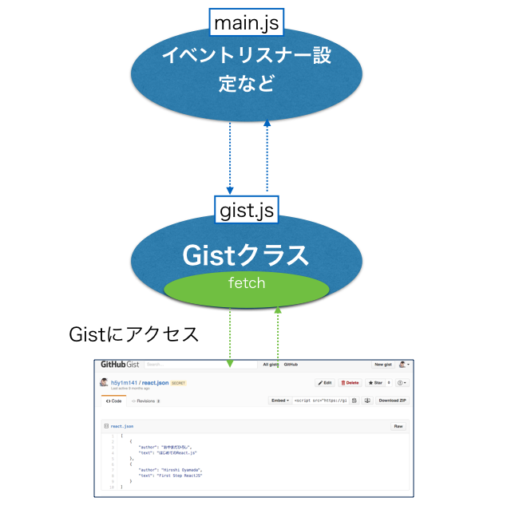

## Jasmineを使ったコードを実際に書く

先ほどでJasmineの構造について説明したのでこれを踏まえて実際にコードを書いて理解を深めてもらおうと思います。

## はじめに最初に作るツールの仕様について

簡単に仕様についてまとめておきます

- Gistという名前のクラス
- そのクラスにはfetch()というメソッドが定義されてる
- fetch()メソッドを実行するとあらかじめ設定済のURLからJSONの情報を取得することが出来る

Gistクラスが定義されてるファイル名をひとまずgist.jsとします。

このGistクラスが期待されてる振る舞いをgist_spec.jsというファイルを作りJasmineの記法に沿ってその振る舞いをまとめていきます。

### fetch()について補足

- サーバーとの通信になるので非同期での処理を想定しており
- 通信処理が正常に完了した場合にdone()というコールバック関数が呼ばれることを想定してます

### 参考まで：gist.jsを利用した実際の取得処理のコード

gist.jsを利用する側を仮にmain.jsとした場合には

```javascript
var promise,
      gist = new Gist();
promise = gist.fetch();
promise.done(function(response){
  console.log(response)  // gistにアクセスした結果が得られて、JSON.parse(response)してJSONとして扱えるようになる
});
```

という感じにすることで、gistの通信処理機能が利用できるようになります。

絵にするとこういうイメージです



今回のようなサンプルではこういう形に分割することのメリットが見出しづらいかもしれませんが、

- GistへのアクセスはGistクラスの責務
- 画面上のユーザーアクションのハンドリングはmain.js

というような形にしておくことで、それぞれの処理内容が明白になっていくかと思います。

