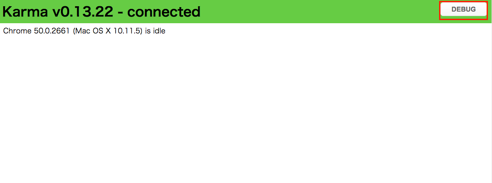

## まずはJasmine自体に慣れてみる

実際の仕事で**メソッドが定義されてる**ことについてテストを書くのは冗長なので実際には無いかと思うのですが、まずはテストを書くことになれるためにこのテストを書いてみます。

### 作業用のディレクトリを作成する

作業に入る前に今回のプロジェクトの直下に以下2つの名前のディレクトリを作成してください

- spec
  - こちらにJasmineを利用したテストコードを格納していきます
- src
  - こちらに上記Jasmineのテストコードにパスする実装を書いていきます


#### 参考情報：テストランナーのKarmaの設定

テスト実行時にはこの2つのディレクトリを参照するようにあらかじめKarmaの設定を作ってます。
具体的には以下の箇所になります。

```javascript
    files: [
      'src/**/*.js',
      'spec/**/*_spec.js'
    ],
```

### テストを書きながら動作確認する

specディレクトリを開いて、新規に**gist_spec.js**という名前のファイルを作ります。

ファイルを作ったら、以下の内容を記述します

```javascript
describe('Gist', function() {
  describe('fetchメソッド', function() {
    it('定義されてる', function(){
    });
  });
});
```

Karmaを起動するコマンドを入力します。

```sh
./node_modules/karma/bin/karma start ./karma.conf.js
```

#### Mac/Windows上で作業してる方

Karma v0.13.22 server started at http://localhost:9876/

というメッセージが表示されているのを確認したら、表示されてるアドレスにWebブラウザでアクセスします。


#### Cloud9を利用してる方

Cloud9でKarmaを起動した場合には

Karma v0.13.22 server started at http://0.0.0.0:8080/

という形でMac/Windows上の環境の方と異なるメッセージが表示されてるかと思いますがその内容を確認した上で、**Cloud9上の上記アドレスをクリックします**

すると以下のようにポップアップウィンドウが表示されるのでOpenをクリックします


新しいタブ（ウィンドウ）が開いて以下の様な画面が表示されることを確認してください


この段階ではテスト対象となる記述が全く無い状態なので、本来は意味がないのですが以下の様な内容を書いてみます

```javascript
describe('Gist', function() {
  describe('fetchメソッド', function() {
    it('定義されてる', function(){
      expect(true).toBe(true);
    });
  });
});  
```

上記内容を記述して保存した後にターミナルに戻ってみると自動的にテストが実行されて緑色の文字でTOTAL: 1 SUCCESSという文字が表示されてると思います


### KarmaのDebug画面を確認する

Karmaを実行してアクセスしたページは以下のようになっており画面右上に**DEBUG** というボタンが表示されてるかと思いますがそのボタンをクリックします。



別のタブ（ウィンドウ）が開いてWebブラウザ上でもJavaScriptが実行されてその結果が表示されてるかと思います


期待される値と実際の値が両方共にtrueなので、当然のことながらこのテストは成功します。
