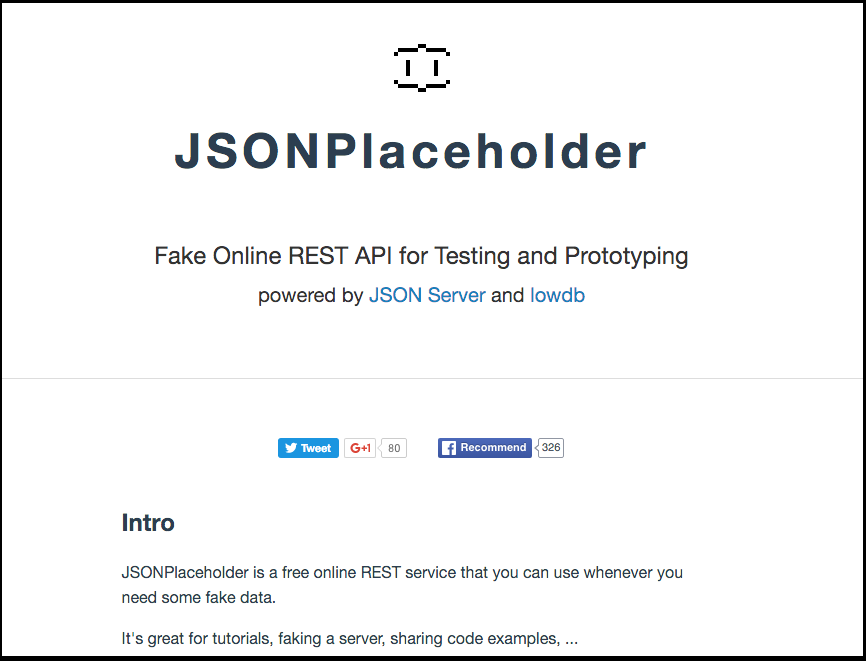

## WebAPI連携のテストを書く

この章では、最近のWebアプリケーションでよくあるRESTの原則に従って実装されているWebAPIと連携する処理に対するJasmineのテストを書いてみます。

メジャーなWebサービスでは、開発者向けにRESTなWebAPIを提供してるのですが、利用にあたって事前準備が色々必要で煩雑な面があるので今回は

> Fake Online REST API for Testing and Prototyping
> 
> http://jsonplaceholder.typicode.com/より

という特徴をもった[JSONPlaceholder](http://jsonplaceholder.typicode.com/) というサービスを利用します。

JSONPlaceholderはサインアップ不要で、利用できます。

