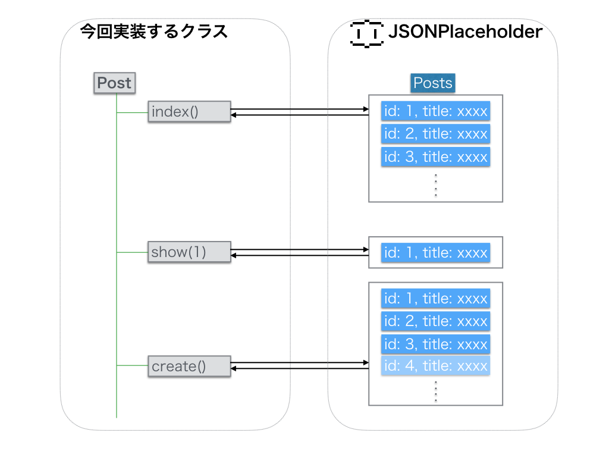

## 実装するクラスの仕様を考える

実装をする前にまずはJSONPlaceholderクラスの仕様を考えてみたいと思います。


JSONPlaceholderのWebAPIは

- posts
- comments
- albums
- photos
- todos
- users

というそれぞれのリソースに対して取得、作成、、削除・・・といった処理が行えるような構造になってます。

なるべくこの構造を維持したクラスが定義できると、自分自身だけではなく他の人からも利用する時にイメージしやすい構造になるかと思います。

### 概念図

今回実装するクラスと、JSONPlaceholderのWebAPI通じて処理するリソースとの対応関係としてこのような対応関係になることをイメージしてます。




### 実装予定のクラスのインターフェースを考える

実装予定のクラスを

```javascript
var jsonPlaceHolder = new JsonPlaceHolder();
```

とした後に例えば投稿情報に対する処理に対しては以下の様なことが行えることを仕様として定義したいと思います。


#### 投稿情報（Posts）に対する一連の操作

```javascript
var id = 1,
    postData = {
      id: 1,
      title: 'タイトル',
      body: '本文'
    };
jsonPlaceHolder.post.index();              // (1)
jsonPlaceHolder.post.show(id);             // (2)
jsonPlaceHolder.post.create(postData);     // (3)
jsonPlaceHolder.post.update(id, postData); // (4)
jsonPlaceHolder.post.destroy(id);          // (5)
```
1. 一覧を取得
2. 指定したIDの投稿情報を取得
3. 投稿情報を作成
4. 指定したIDの投稿情報を更新
5. 指定したIDの投稿情報を削除

#### コメント（Comments）に対する一連の操作

コメント情報に対する処理に対しては以下の様なことが行えることを仕様として定義したいと思います。

```javascript
var id = 1,
    postData = {
      id: 1,
      title: 'タイトル',
      body: '本文'
    };
jsonPlaceHolder.comments.index();              // (1)
jsonPlaceHolder.comments.show(id);             // (2)
jsonPlaceHolder.comments.create(postData);     // (3)
jsonPlaceHolder.comments.update(id, postData); // (4)
jsonPlaceHolder.comments.destroy(id);          // (5)
```

1. 一覧を取得
2. 指定したIDのコメントを取得
3. コメントを作成
4. 指定したIDのコメントを更新
5. 指定したIDのコメントを削除


なお、今回は、時間の都合もあって特定のリソース（投稿情報）の対しての説明だけになります。
