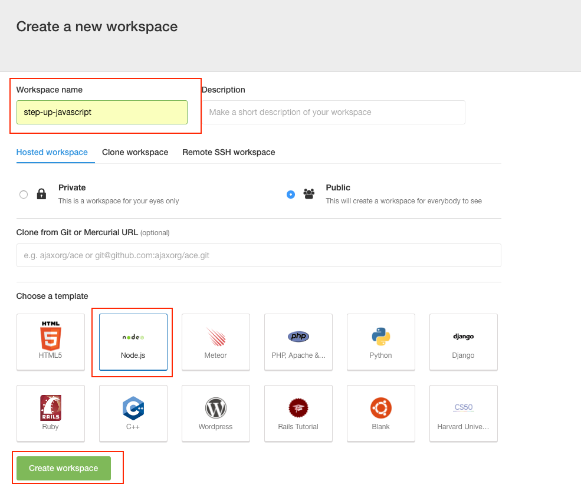
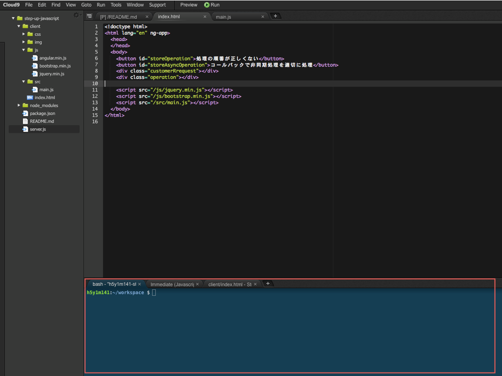
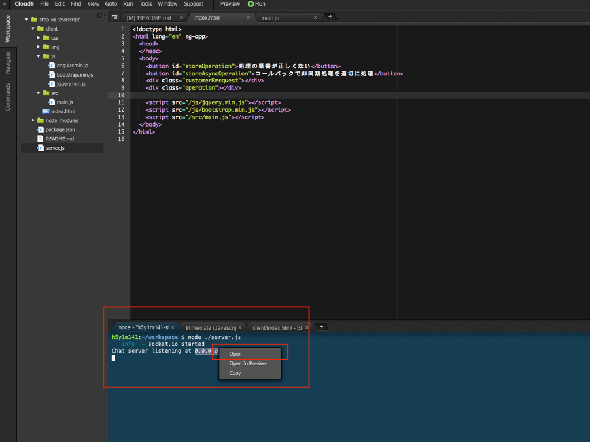

# Cloud9というクラウド上の環境を利用する

Cloud9はメニューが英語なのでその点で少しとっつきづらいかもしれませんが、Node.jsの実行環境だけではなく開発時のエディタ機能も備わってますので、余計な環境構築に時間がとられること無く、開発自体に専念できる環境かと思います。

## Cloud9に登録する

以下サイトにアクセスします


https://c9.io/

画面右上にあるGitHubアイコンをクリックすることで、GitHubアカウントでの登録も可能で基本的にはそちらでの登録をオススメします。


## Cloud9を利用して作業を開始する

アカウントの登録が完了したら、Node.jsの実行環境を作成するためにワークスペース（workspace）を設定します




上記スクリーンショットの赤枠でも囲っていますが、基本的には

- Workspace nameを設定
  - 例えば**step-up-javascript**のようにして任意の名前をつけます
- Templateを選択
  - Node.jsのアイコンがあるのでそれを選択

を行った上で、Create workspaceのボタンをクリックすれば環境構築が完了します。

環境が出来上がるまで少し待ちますが、構築が完了すると以下の様な開発時の統合開発環境の画面が表示されます。


## 開発時の基本操作

Webブラウザ上で表示・動作確認できるようなサンプルを中心に資料を作ってますが、動作確認などでNode.jsのサーバー機能を利用するケースも出てくるので、Cloud9を利用した開発時に利用しそうな機能について簡単に記載しておきます

### ファイル・フォルダを作る

左側のメニューの任意の箇所を右クリックすること以下の様なメニューが表示されるので、


### コマンドを入力してサーバー機能を立ち上げる

画面下部にコマンドを入力するためのターミナルが表示されています



上記画面の赤枠で囲った箇所のタブで**bash**という表示の箇所をクリックすると以下の様にコマンドを入力することができますので

```sh
node ./server.js
```

と入力をします。


入力完了すると以下の様な表示になります





```sh
Chat server listening at 0.0.0.0:8080
```

という表示の最後の部分の**0.0.0.0:8080**にマウスカーソルを合わせるとクリック出来る状態になりますのでそこをクリックすると、小さいウィンドウが表示されるので**open**を選択すると、browserの別ウィンドウが表示されます。

これを行うことで簡単にWebサーバー機能を利用することが出来て、自分で作ったJavaScriptの動作確認が行えるので基本的には開発時にはこの機能を活用しながら作業することをオススメします。
