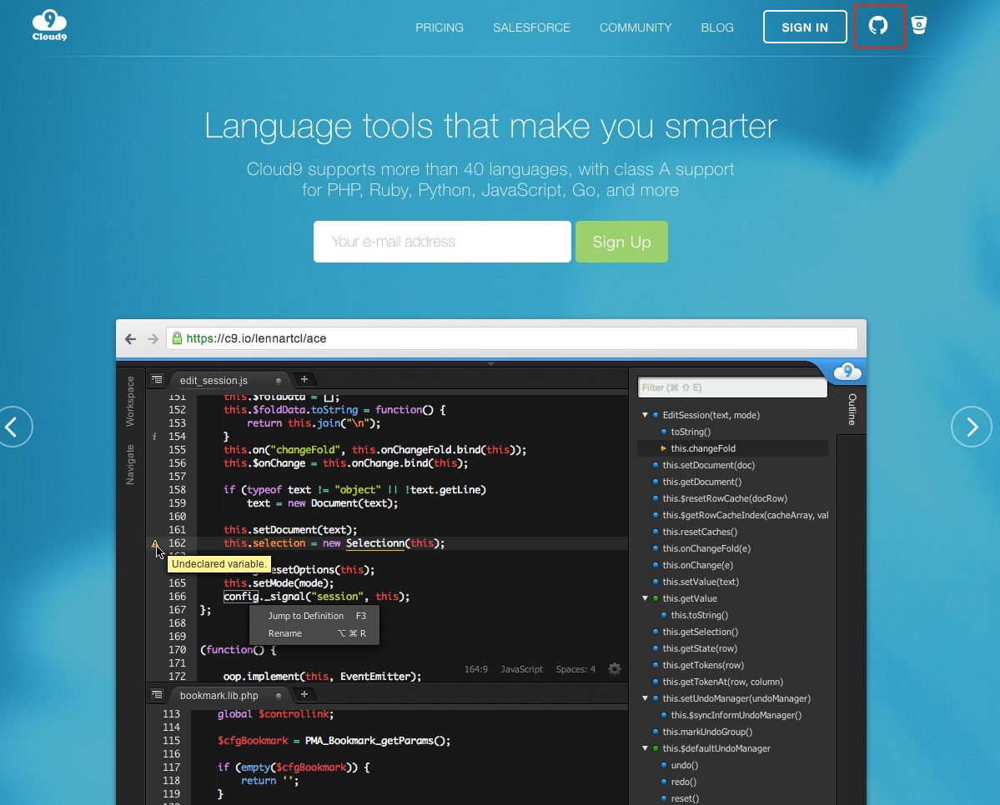

# Cloud9というクラウド上の環境を利用する

Cloud9はメニューが英語なのでその点で少しとっつきづらいかもしれませんが、Node.jsの実行環境だけではなく開発時のエディタ機能も備わってますので、余計な環境構築に時間がとられること無く、開発自体に専念できる環境かと思います。

## Cloud9に登録する

以下サイトにアクセスします

https://c9.io/

画面右上にあるGitHubアイコンをクリックすることで、GitHubアカウントでの登録も可能で基本的にはそちらでの登録をオススメします。

## Cloud9を利用して作業を開始する

アカウントの登録が完了したら、Node.jsの実行環境を作成するためにワークスペース（workspace）を設定します

上記スクリーンショットの赤枠でも囲っていますが、基本的には

- Workspace nameを設定
  - 例えば**step-up-javascript**のようにして任意の名前をつけます
- Templateを選択
  - Node.jsのアイコンがあるのでそれを選択

を行った上で、Create workspaceのボタンをクリックすれば環境構築が完了します。

環境が出来上がるまで少し待ちますが、構築が完了すると以下の様な開発時の統合開発環境の画面が表示されます。

## 開発時の基本操作

基本的にはNode.jsのサーバー機能を利用しながら開発をすすめることを念頭に置きながら資料を作ってます。

Cloud9を利用した開発時に利用しそうな機能について簡単に記載しておきます

### ファイル・フォルダを作る

### 任意のコマンドを実行する

### サーバー機能を立ち上げる

