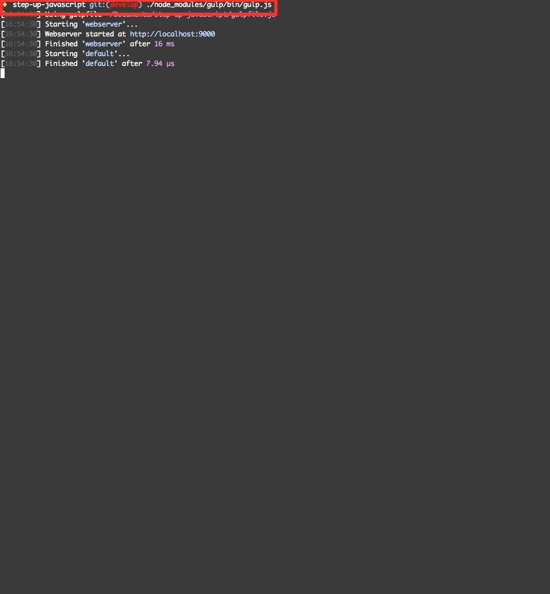

# Mac/Windows上でNode.jsの環境を利用する

普段からNode.js環境を利用してる方の場合には、npmが利用できる状況かと思いますので、以下手順での環境構築が手軽なのでこちらでもOKです。


## 動作確認環境


以下のとおりです。

- Mac OS X Yosemite（10.10.5）
- Mac OS X El Capitan（10.11.4）
- Node.js
  - v4.2.4

### Nodeのバージョンについて

Node.js v4とNode.js v5の違いはNode.js 日本ユーザーグループ代表の方が書いた以下記事が参考になります。

> Node.js v4はLTSというリリースしてから2年半サポートするサポートポリシーがついていますが、Node.js v5にはついていません。つまり、 Node.js v5は次のバージョンが出たらサポートされなくなります。 今のところ、 LTSの対象になるのは偶数のバージョンとされています。ただし、偶数のバージョンが必ずLTSというわけではなく、今のところ偶然そういうバージョンになっているというのが正しい状態なので、きちんとLTSかどうかを把握するためには、バージョン番号の他にLTS識別名(ArgonやBoron等の元素名)が付いていることを確認したほうがよいです。
> 
> [今からでも間に合う！Node.js v4＆v5は何が変わったか？](https://html5experts.jp/yosuke_furukawa/17791/)
  
### Node.jsのインストール方法

Macの場合には色々あるかもしれませんが、私はNode.jsはnodebrewを利用してインストールしてます。


```sh
nodebrew -v
nodebrew 0.9.2

Usage:
    nodebrew help                         Show this message
    nodebrew install <version>            Download and install a <version> (compile from source)
    nodebrew install-binary <version>     Download and install a <version> (binary file)
    nodebrew uninstall <version>          Uninstall a version
    nodebrew use <version>                Use <version>
    nodebrew list                         List installed versions
    nodebrew ls                           Alias for `list`
    nodebrew ls-remote                    List remote versions
    nodebrew ls-all                       List remote and installed versions
    nodebrew alias <key> <version>        Set alias to version
    nodebrew unalias <key>                Remove alias
    nodebrew clean <version> | all        Remove source file
    nodebrew selfupdate                   Update nodebrew
    nodebrew migrate-package <version>    Install global NPM packages contained in <version> to current version
    nodebrew exec <version> -- <command>  Execute <command> specified <version>

Example:
    # install from binary
    nodebrew install-binary v0.10.22

    # use a specific version number
    nodebrew use v0.10.22

    # io.js
    nodebrew install-binary io@v1.0.0
    nodebrew use io@v1.0.0
```

## 環境構築する

いつも通りに

```sh
npm install
```

していただけれればOKです

参考までに作業時の画面キャプチャを以下貼っておきます


## npm install 完了したら、gulpのweb server機能が動作するか確認

以下コマンドでgulpのweb server機能が動作するか確認してください

```sh
./node_modules/gulp/bin/gulp.js
```


