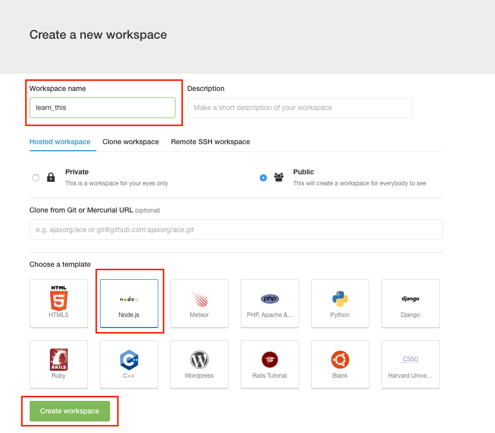

## thisについて

JavaScriptでのプログラミングをする上でthisの理解というのは欠かせないものの１つかと思います。

thisの理解をする上で以下の概念の理解がポイントになるかと思ってます。

- アクティベーションオブジェクトとスコープチェーン
  - 関数呼び出し時に作成される目に見えない変数オブジェクトがあり、それは**アクティベーションオブジェクト（もしくはCallオブジェクト）**と呼ばれる
- 関数呼び出し時にthisが生成される
  - 呼び出し時にthisが自動的に生成される
- thisの呼ばれ方は４パターン
  - トップレベルのthis
  - コンストラクタ内のthis
  - 何かに所属している時のthis
  - thisを外部から書き換えられる場合
    - function#apply
    - function#call

サンプルコードを示しつつ、実際の挙動についてGoogle ChromeのDevelopetToolsを使って確認してもらうことを通じて理解の手助けとなるような解説をしていこうと思います。


## 最初にプロジェクトの設定を行う


サンプルコードを実行する時に

- ローカルのWebサーバー機能
- jQuery

を念頭に置いて資料を作ってありますので各自の環境に応じて以下の設定を行ってください


### Cloud9を利用してる場合

- ワークスペースの名前はひとまず**learn_this**という名称で作成してください。



ワークスペースの設定が完了すると初期設定段階でjQueryとローカルのWebサーバー機能がそのまま利用できる状態になってます。

詳しくは[Cloud9というクラウド上の環境を利用する](../set_up_cloud9.md)のページの**コマンドを入力してサーバー機能を立ち上げる**の項目を参照してください

#### HTMLを修正する

初期段階のHTMLは不要な記述が多いので、clientフォルダの中のindex.htmlを開いて以下の内容に書き換えてください。

```html
<html>
  <head></head>
  <body>

    <script src="/js/jquery.min.js"></script>
    <script type="text/javascript" src='/js/main.js'></script>
  </body>
</html>
```


### Mac/Windows上でNode.jsの環境を利用する場合


- ローカルのWebサーバー機能
- jQuery

を利用するために必要なnpm モジュールをインストールします。

```json
{
  "name": "learn_async",
  "version": "1.0.0",
  "description": "",
  "author": "",
  "license": "MIT",
  "dependencies": {
    "gulp": "^3.9.0",
    "gulp-webserver": "*",
    "jquery": "^2.1.3"
  }
}
```

```sh
npm install
```


#### HTMLを作成する

index.htmlを作成して以下内容を記述します

```html
<html>
  <head></head>
  <body>

    <script type="text/javascript" src='/node_modules/jquery/dist/jquery.js'></script>
    <script type="text/javascript" src='/js/main.js'></script>
  </body>
</html>
```

#### Webサーバー機能を利用するための設定

gulp-webserverを利用してWebサーバーを立ち上げるために**gulpfile.js**を作成して以下内容を記述します

```javascript
var gulp = require('gulp');
var webserver = require('gulp-webserver');

gulp.task('webserver', function() {
  gulp.src('./')
    .pipe(webserver({
      livereload: false,
      port: 9000,
      fallback: 'index.html',
      open: true
    }));
});

gulp.task('default', ['webserver']);
```

gulpfile.jsを作成したら、以下コマンドを実行します

```sh
./node_modules/gulp/bin/gulp.js
```

Webブラウザを開いて以下にアクセス出来るのを確認してください。


http://localhost:9000/index.html

