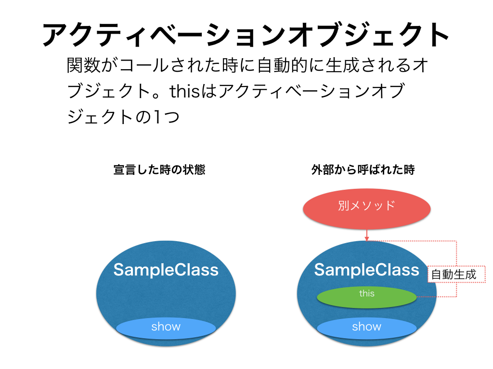
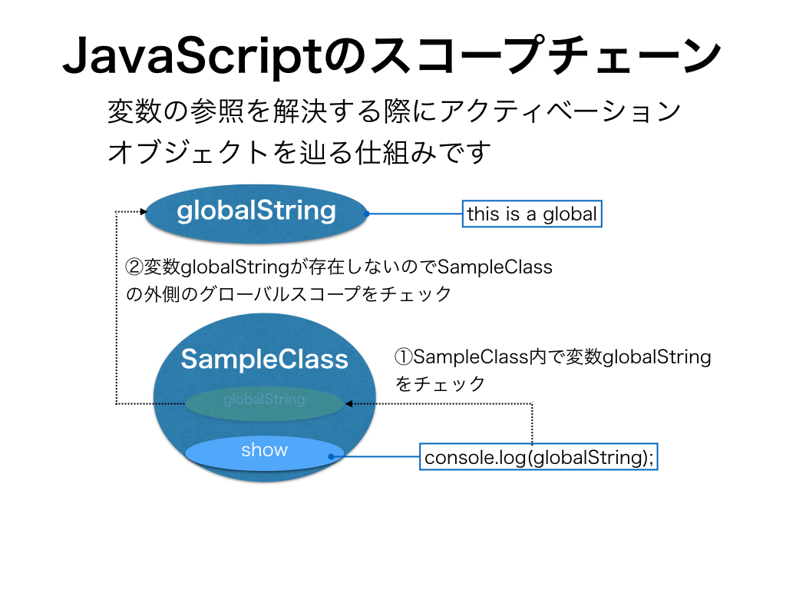

## アクティベーションオブジェクトとスコープチェーンについて

thisの理解をする上でアクティベーションオブジェクトとスコープチェーンの概念を抑えておく必要があるかと思うのでご紹介します。

### アクティベーションオブジェクトとは？

関数呼び出し時に作成される目に見えない変数オブジェクトというものがあり、その目に見えない変数オブジェクトのことを**アクティベーションオブジェクト**（もしくはCallオブジェクト）といいます。

この変数オブジェクトは関数の実行時に生成されます。関数宣言しただけではアクセスすることができません。



上記の概念図で記載してますがthisはアクティベーションオブジェクトの1つです。


### スコープチェーンについて

以下のコードを例にしながらスコープチェーンについて解説します。

```javascript
var globalString,
    sample;
globalString = 'this is a global';

SampleClass = function(){
  this.show = function(){
    console.log(globalString);  // (1)
  };
};
sample = new SampleClass();
sample.show();
```

- sample.show()実行時には実際にはコメント(1)の箇所が評価されます
- JavaScriptは関数ごとにスコープがあるのでまずはthis.show()の中で変数globalStringが定義されてるかどうか探されます
- このコードの場合にはthis.show内部には変数globalStringは存在しないため、関数のスコープに変数が見つからなかった場合には外側のスコープを探しにいきます
  - このコードの場合には外側はグローバル変数にあたるのでそこで変数globalStringが存在するかどうか探されてglobalString が見つかります
    - this is a globalが代入されてる箇所

ここまでの流れを図にすると以下のようになります。



スコープチェーンを解説した理由ですがグローバル変数の領域にもthisは存在しており、Webブラウザの場合にはwindowオブジェクトになります。

またJavaScriptのグローバル変数はwindowオブジェクトのプロパティになるので上記のサンプルコードだと

```javascript
var globalString,
    sample;
globalString = 'this is a global';
```

のglobalStringの箇所は

```javascript
window.globalString
this.globalString
```

と同じ意味になります。

