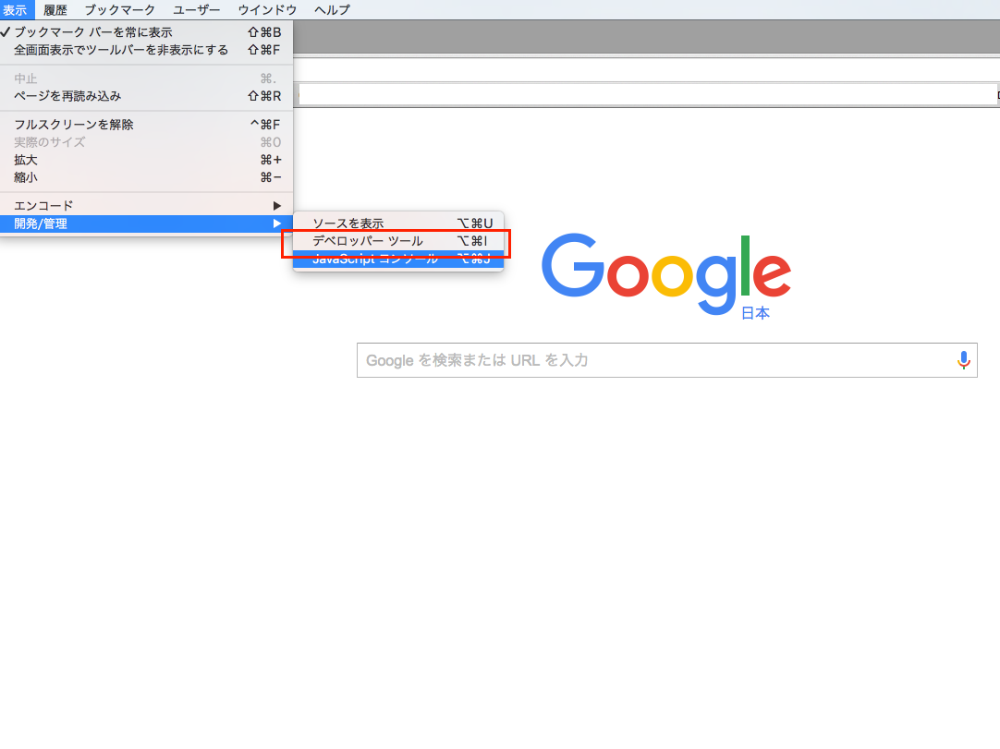
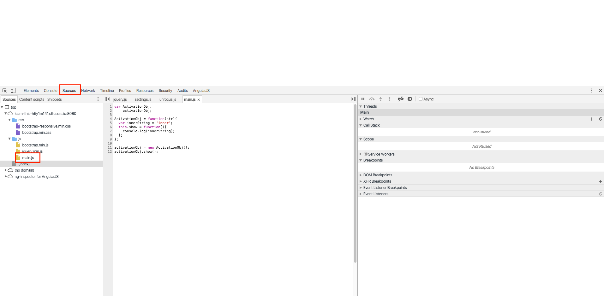
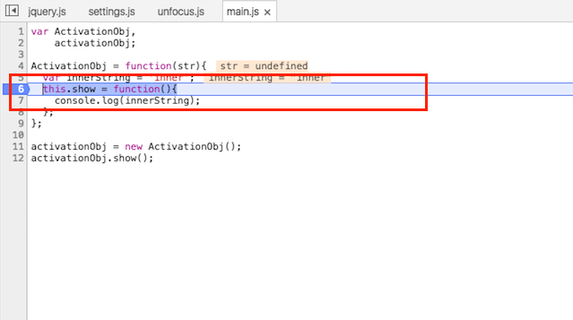
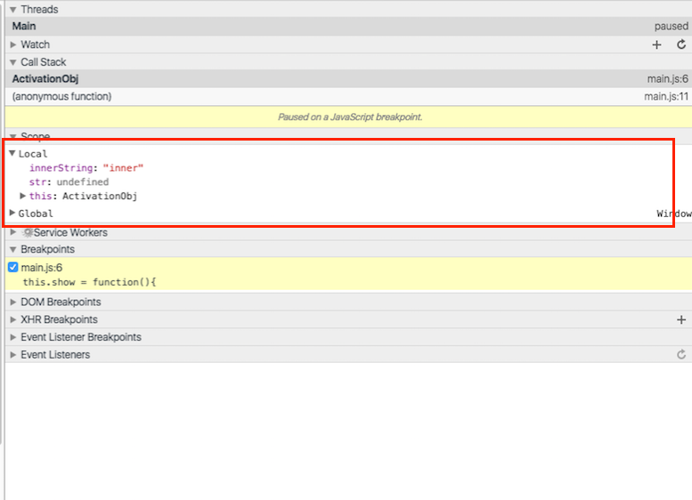

## 関数呼び出し時にthisが生成される

実際にサンプルコードを書きながら関数呼び出し時にthisが生成されることを確認してみます。

先ほど設定したプロジェクトのjs/main.jsに以下内容を記述します

```javascript
var SampleClass,
    sample;
    
SampleClass = function(str){
  var innerString = 'inner';
  this.show = function(){
    console.log(innerString);
  };
};

sample = new SampleClass();
sample.show();
```

記述が完了したら動作を確認します。

#### Cloud9の環境の方

コマンドを入力してWebサーバー機能を立ち上げて指定のアドレスにアクセスします。

詳しくは[Cloud9というクラウド上の環境を利用する](../set_up_cloud9.md)のページの**コマンドを入力してサーバー機能を立ち上げる**の項目以降を参考に作業してみてください。

#### ローカルのNode環境を利用してる方

gulp-webserverは9000番ポートを利用してサーバーが起動してますので

http://localhost:9000

にアクセスします。

### 実際に確認してみる

GoogleChromeを使ってサイトにアクセスしてから、デベロッパーツールを表示させます。

デベロッパーツールは以下のようにChromeのメニューの**表示**→**開発・管理**→**デベロッパーツール**と進むことで表示されます。



画面が上下に分かれて、下部にデベロッパーツールが表示されるので以下作業をします

1. Sourceタブを選択
2. 左側に読み込まれてるJavaScript、CSSの一覧が表示されます
3. 今回実装したmain.jsを選択すると、デベロッパーツールの真ん中のウィンドウに先ほど実装したmain.jsの中身が表示されます。




main.jsが表示されたら**処理を一時停止させるためにthis.showの横のあたりをマウスでクリック**してください。

クリックした箇所の左側に青矢印がこのように表示された状態になったことを確認してください



この状態でWebブラウザの再読み込みボタンをクリックすると先ほどクリックした箇所の記述が実行されるタイミングでこのように↓処理が一時停止します。


上記画面の一部を拡大した画像を以下貼りますがこのようにthisが自動的に生成されてることが確認できるかと思います。



## まとめ

GoogleChromeのデベロッパーツールを利用して関数呼び出し時にthisが生成されてることが確認できたかと思います。

thisは関数実行時に生成されますが、thisが呼ばれる方法としては全部で4パターンあるのでそのそのあたりのことを念頭に置いておくともう少し理解が深まると思うので次で順番に解説していきます。
