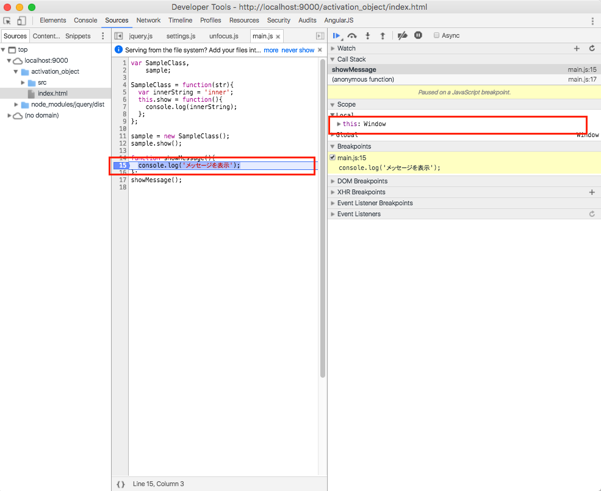

## thisの呼ばれ方その１：トップレベルのthis

[アクティベーションオブジェクトとスコープチェーンについて](about_this_02.md)のページで紹介しましたが、グローバル変数の領域にもthisは存在しており、Webブラウザの場合にはwindowオブジェクトになります。

## 実際に動作確認してみる

簡単なサンプルコードを書いて実際にトップレベルのthisについて確認してみます。

設定したプロジェクトのjs/main.jsに以下内容を追記します。

```javascript
function showMessage(){
  console.log('メッセージを表示');
};
showMessage();
```

コードの修正が完了したら、GoogleChromeを使ってサイトにアクセスしてから、デベロッパーツールを表示させます。


1. console.log('メッセージを表示')の横のあたりをマウスでクリックしてブレークポイントを設定
2. この状態でWebブラウザの再読み
3. 設定したブレークポイントの箇所で以下のように処理が止まってその時にthisが生成されてることを確認してみてください。


