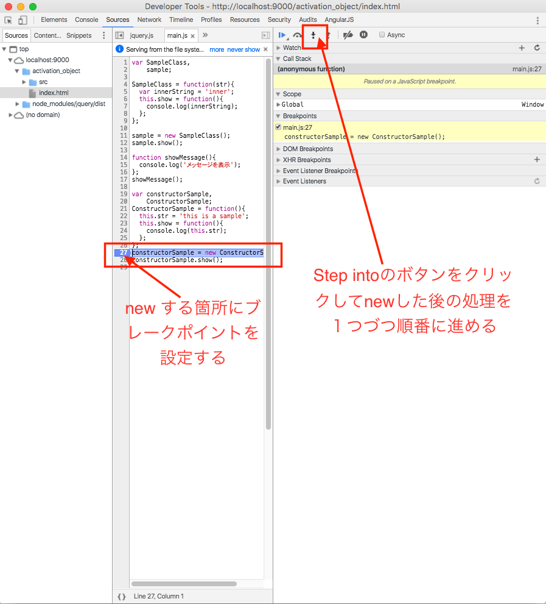
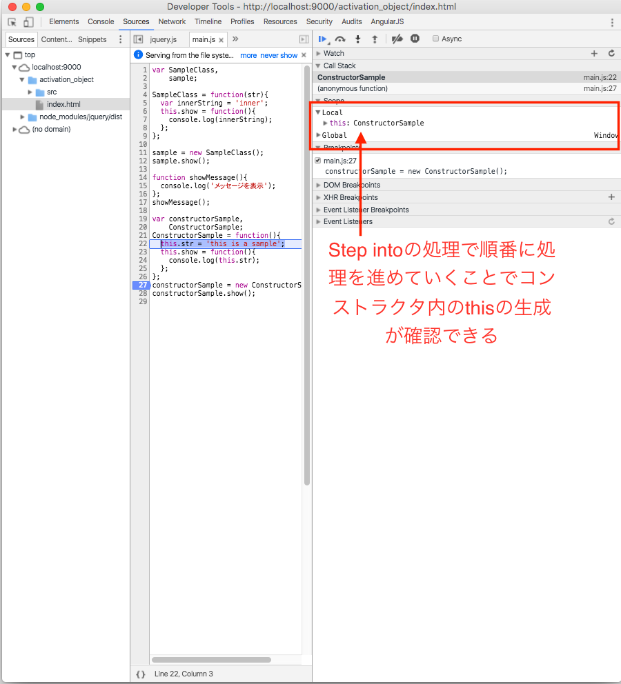

## thisの呼ばれ方その２：コンストラクタ内のthis

こちらは[関数呼び出し時にthisが生成される](about_this_03.md)のページで紹介したしましたが、グローバル変数の領域にもthisは存在しており、Webブラウザの場合にはwindowオブジェクトになります。


## 実際に動作確認してみる

先ほどと同様に設定したプロジェクトのjs/main.jsに以下内容を追記します。

```javascript
var constructorSample,
    ConstructorSample;
ConstructorSample = function(){
  this.str = 'this is a sample';
  this.show = function(){
    console.log(this.str);
  };
};
constructorSample = new ConstructorSample();
constructorSample.show();
```

コードの修正が完了したら、GoogleChromeを使ってサイトにアクセスしてから、デベロッパーツールを表示させます。


1. constructorSample = new ConstructorSample()の横のあたりをマウスでクリックしてブレークポイントを設定
2. この状態でWebブラウザの再読み
3. 設定したブレークポイントの箇所で以下のように処理が止まります。コンストラクタ内のthisを確認するためには1つづつ処理を進めていく必要がありそのためには、以下画面キャプチャで囲ってるStep intoのボタン箇所をクリックしながら処理を進めていきます
4. 順番に処理を進めていくことで以下のようにコンストラクタ内のthisが生成されるタイミングが確認できるかと思います

