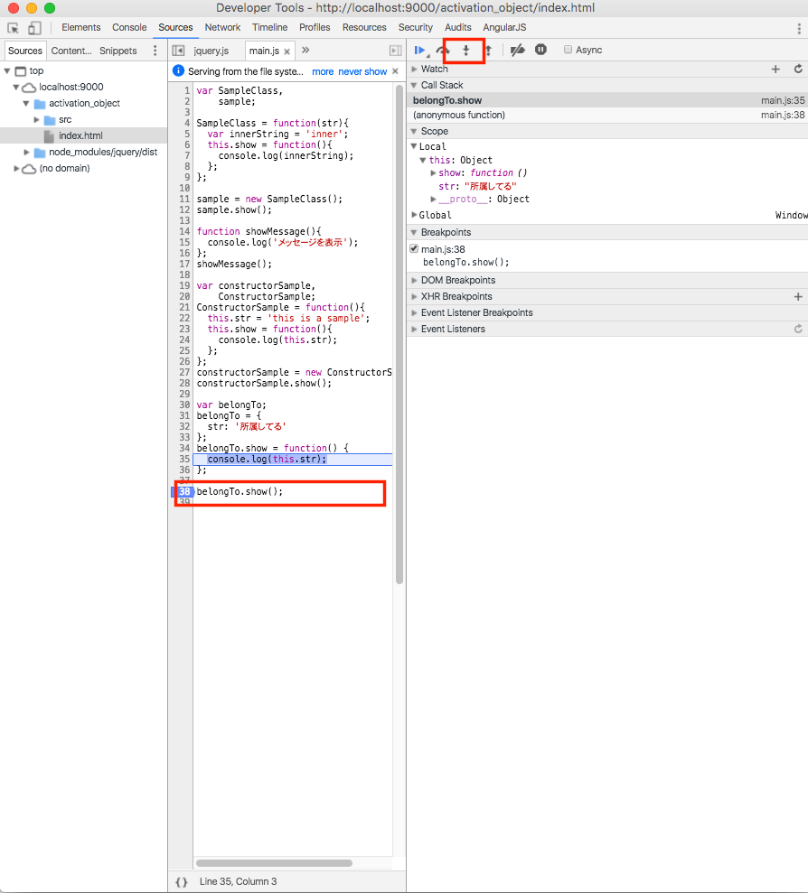

## thisの呼ばれ方その３：何かに所属している時のthis


例えば以下の様なコードがあったとします。

```javascript
var belongTo;
belongTo = {
  str: '所属してる'
};
belongTo.show = function() {
  console.log(this.str);
};

belongTo.show();
```

belongToというオブジェクトに属するstrを参照するshowが呼ばれる時にthisが生成されることを以下の手順で確認してみます。

## 実際に動作確認

先ほどと同様に設定したプロジェクトのjs/main.jsに上記のサンプルコードを追記します。

コードの修正が完了したら、GoogleChromeを使ってサイトにアクセスしてから、デベロッパーツールを表示させます。

1. belongTo.show()の横のあたりをマウスでクリックしてブレークポイントを設定
2. この状態でWebブラウザの再読み
3. 設定したブレークポイントの箇所で以下のように処理が止まるので、以下画面キャプチャで囲ってるStep intoのボタン箇所をクリックしながら処理を進めていきます
4. console.log(this.str)の箇所に処理が移った所でthisが生成されていることが確認出来るかと思います。

