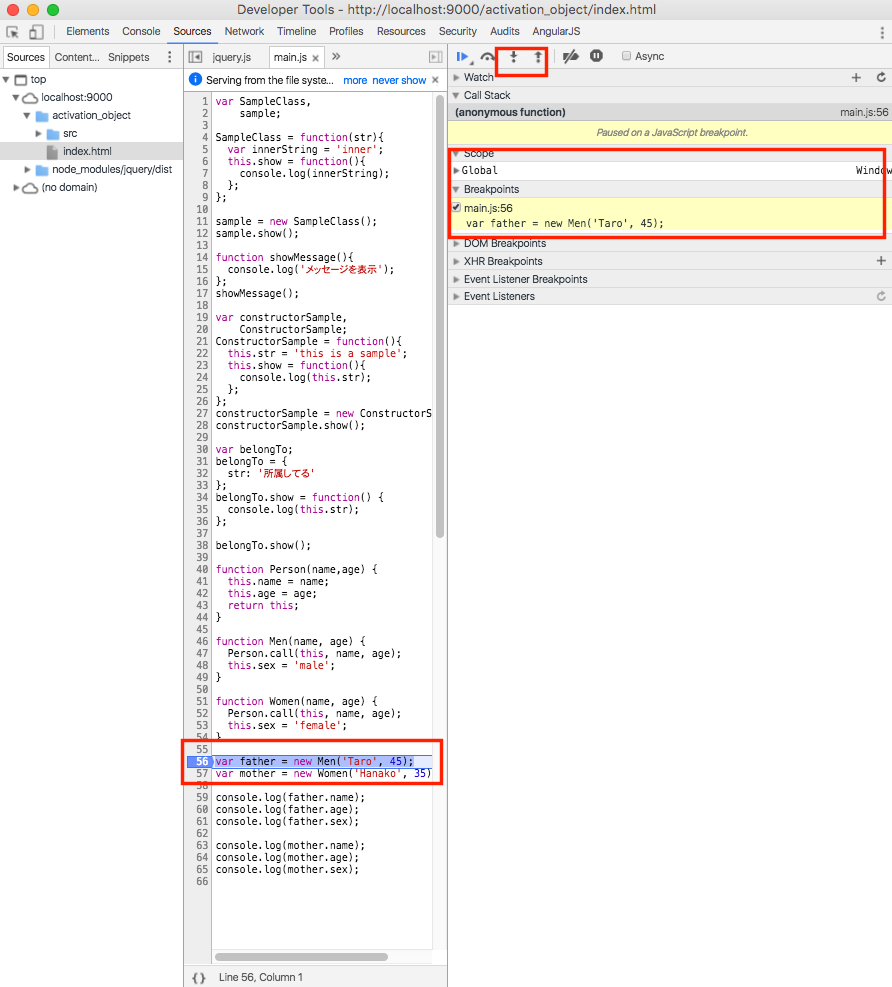
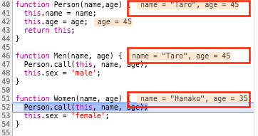

## thisの呼ばれ方その４：外部から書き換えられるthis

最後に外部から書き換えられるthisですが、これはcall/applyを

- メソッド名.call(this, strVariable)
- メソッド名.apply(this. arrayVariable)

という形で利用することで、thisが書き換わります。

## 実際に動作確認してみる

[JavaScript:call と apply の使い方と違いについて](http://www.sirochro.com/note/js-call-apply-difference/)という記事で比較的イメージしやすいたサンプルコードがあったのでこちらを引用してcallを利用した時の動作について確認してみます

```javascript
function Person(name,age) {
  this.name = name;
  this.age = age;
  return this;
}

function Men(name, age) {
  Person.call(this, name, age);
  this.sex = 'male';
}

function Women(name, age) {
  Person.call(this, name, age);
  this.sex = 'female';
}

var father = new Men('Taro', 45);
var mother = new Women('Hanako', 35);
console.log(father.name);
console.log(father.age);
console.log(father.sex);
```


先ほどと同様に設定したプロジェクトのjs/main.jsに上記のサンプルコードを追記します。

コードの修正が完了したら、GoogleChromeを使ってサイトにアクセスしてから、デベロッパーツールを表示させます。

1. var father = new Men('Taro', 45の横のあたりをマウスでクリックしてブレークポイントを設定してこの状態でWebブラウザの再読みします
2. 設定したブレークポイントの箇所で以下のように処理が止まるので、以下画面キャプチャで囲ってるStep intoのボタン箇所をクリックしながら処理を進めていきます
3. 上記ブレークポイントの段階ではまだthisが生成されていませんが、Step intoのボタンをクリックして処理を1つ進めるとthisが生成されていることが確認出来て、この段階ではMenが格納されてるのが確認できます。
4. さらにStep intoのボタンをクリックして処理を1つ進めていきnew Womenの箇所が評価されるとthisの値がMenからWomenに変更されてるのが以下のように確認できます。

thisの値が書き換わるタイミングを把握しづらい場合にはStep intoを実行する度に以下赤枠で囲った箇所の値が動的に変化していきますのでそこを注意深く確認しておくことで置き換わるタイミングが確認できるかと思います



## 参考情報：call/applyを実際に利用してるコードを知る

上記のような書き方を利用してcall/applyを活用するコードというのは慣れないうちはあまり積極的に使うことは無いかもしれませんが、JavaScriptでの開発で利用される外部のライブラリ/フレームワークなどではこういう書き方を利用してるコードがあるので、簡単に紹介だけしておきます。

### Backbone.jsのModelの実装箇所

Backbone.js（バージョン1.3.3）で、Modelの機能を拡張する処理の所で以下コードで、初期化時にapplyを利用している記述があります。

```javascript
  var Model = Backbone.Model = function(attributes, options) {
    // 〜中略〜
    this.initialize.apply(this, arguments);
  };
```

Backbone.jsに限らず他のフレームワークやライブラリで、親となる機能を継承する処理を実現したい場合にこういう形でapplyなどを利用してるケースというのがありますので興味ある方は一度調べてみると色々勉強になるかと思います。

## まとめ

この章では

- 関数呼び出し時にthisが生成される
- thisが呼ばれるパターンは4つある

ということを説明しました。

thisの概念を理解するのは簡単ではないかもしれないので理解が進まない箇所はサンプルコード内で適宜ブレークポイントを設定しつつ、Step intoで処理を１つづつ進めながらその時々の値を確認することで理解が深まるかと思いますのでぜひ、そのような形で復習していただければと思います。
