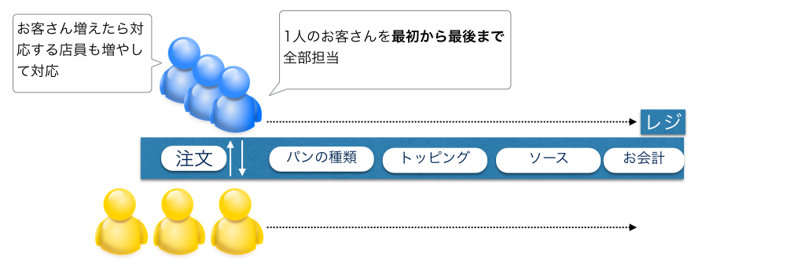
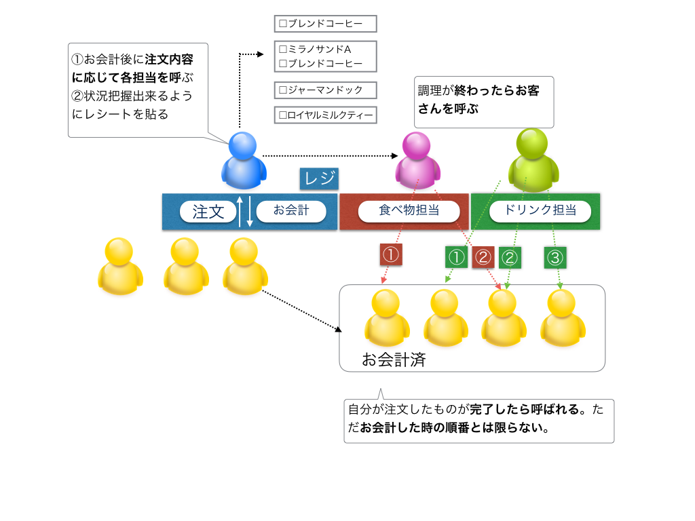
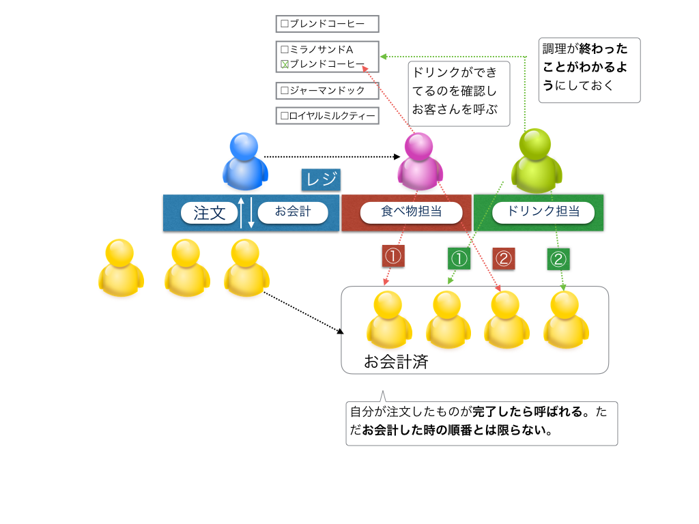

# 非同期処理の概念について解説

サブウェイとドトールコーヒーでのオペレーションを例にしながら、同期・非同期処理を対比させながら、非同期処理について説明します。

## 同期処理について

[サブウェイに行った場合の商品注文方法](http://www.subway.co.jp/menu/howtoorder/)によると、お客さんは店舗で

- メニューの中からサンドイッチを決める
- パンを選ぶ
- お好みで野菜の量を増減
- ドレッシング・ソースをかける

という流れで店員さんに注文していきます。

注文から最終的なお会計までの流れを図にすると以下のようになります。

同期的に処理をする場合に、順番に処理がされていくので把握しやすいかと思います。

ただ以下の様な状況の時には問題が生じてしまいます。

- 例えばカスタマイズの多いお客さんがいた場合にその対応に時間かかる
- 上記対応が終わるまで、前のお客さんの対応が終わるまで待たされる
- （飲み物専用のレジがない限り）飲み物だけのような注文内容がシンプルな場合にも、そのお客さんも前のお客さんの対応が終わるまで待たされる

同期処理の特徴としては以下の様な点かと思います。

- 順番に処理がされるので全体で見ると処理内容が把握しやすい
- 特定の処理で時間がかかる場合にそれ以降の処理が待たされる

## 非同期処理について

サブウェイの場合には、注文からお会計までが一連の流れになっていたのに対して、ドトールコーヒーの場合には、

- 注文する
- お会計する
- 注文したものが出来上がったら呼ばれるので商品を受け取る

という形なり、注文から実際に商品を受け取るまでの流れを図にすると以下のようになります。

同期処理の場合だと、対応に時間かかるお客さんがいるとそれ以降のお客さんは待たされることがありましたが、非同期処理の場合には**処理がおわった順番に呼ばれる**のでそのような問題は生じません。

ただし**処理が一方通行ではないため全体で見ると処理内容が把握しづらくなる可能性が高く**なります。

例えば、上記の図で、飲み物と食べ物がそれぞれ出来上がったタイミングでお客さんを呼ぶようにしてましたが、例えばテイクアウトするお客さんの対応の場合にはこのようなオペレーションはできなくなるため、2つが出来上がったタイミングでまとめて呼ばないといけなくなります。

非同期処理の場合には、状態を確認→何らかの処理ということが生じやすくなるのが特徴かと思います。

## まとめ

飲食店でのオペレーションを例に同期処理、非同期処理についてそれぞれ説明をしました。

JavaScriptでプログラミングする時には、非同期処理になることが多いので、上記の例だとドトールのような流れになるため、処理が一方通行ではないため全体で見ると処理内容が把握しづらくなる可能性が高くなります。

ただし書き方を工夫することで、JavaScriptでのプログラミングを同期処理のような感覚で書くことは可能なので、次でサンプルコードを例にしながら説明していきます
