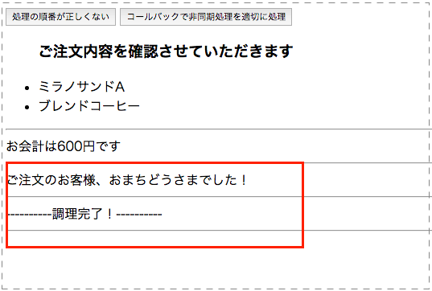

## 非同期処理を考慮しない書き方

HTMLに以下を追加します

### index.html

```html
<body>
  <button id="storeOperation">処理の順番が正しくない</button>
  <div class="customerRequest"></div>

  <div class="operation"></div>
  <!-- 以下省略 -->
```

上記で読み込まれるJavaScriptは、js/main.jsというファイルを作ってそこに以下を記述します。

### js/main.jsの中身

```javascript
var customerRequestTotal,
    customerOrderRequest = {
      food:  { jp: 'ミラノサンドA', en: 'milanoA'},
      drink: { jp: 'ブレンドコーヒー', en: 'brendCoffee' }
    },
    messages = {
      confirm: '<ul><h3>ご注文内容を確認させていただきます</h3>' +
        '<li>' + customerOrderRequest.food.jp + '</li>' +
        '<li>' + customerOrderRequest.drink.jp + '</li>' +
        '</ul><hr />',
      callCustomer: 'ご注文のお客様、おまちどうさまでした！<hr />',
      cookingDone: '----------調理完了！----------<hr />'
    };
var calculate = function(){
  var priceList = {
    food:  { milanoA: 400 },
    drink: { brendCoffee: 200 }
  };
  customerRequestTotal = priceList.food[customerOrderRequest.food.en] +
    priceList.drink[customerOrderRequest.drink.en];
};
var sayTotalPrice = function(){
  $('.operation').append('お会計は' + customerRequestTotal + '円です');
  $('.operation').append('<hr />');
};
var confirmOrderRequest = function(){
  $('.customerRequest').append(messages.confirm);
};
var cookingStaffCallCustomer = function(){
  $('.operation').append(messages.callCustomer);
};
var cookingStaffOperation = function(){  // (1)
  setTimeout(function(){
    $('.operation').append(messages.cookingDone);
  }, 3000);
};
var storeOperation = function(){
  calculate(customerOrderRequest);
  confirmOrderRequest();
  sayTotalPrice();
  cookingStaffOperation();     // (2)
  cookingStaffCallCustomer();  // (3)
};
$('#storeOperation').on('click',storeOperation);  // (4)
```

上記のJavaScriptを保存して、HTMLを開くとボタンが1つ表示されるのでそれをクリックすると実行すると以下のようになります。



先に**ご注文のお客様、おまちどうさまでした！**のメッセージが表示された後に、**----------調理完了！----------**のメッセーがが表示されてしまってます。

処理としては

- ソースコード内の(4)の箇所で、ボタンクリックでstoreOperationが実行される。
- storeOperation内の各メソッドが順番に実行され、cookingStaffOperationとcookingStaffCallCustomerのメソッドが実行される
- JavaScriptは**非同期処理なのでcookingStaffOperationの結果を待たずに**cookingStaffCallCustomerも実施される
  - cookingStaffOperation内でsetTimeoutを利用して3000ミリ秒（3秒）後に処理が行われる
    - 3秒後に調理完了のメッセージが挿入される
  - cookingStaffCallCustomer内の処理はすぐに完了してしまうので、ご注文のお客様、おまちどうさまでした！のメッセージが先に挿入されてしまう
  
という流れになるため、本来意図した流れにはならなくなってます。

次で非同期処理を考慮した書き方に書き換えて本来期待される状態に修正します。
