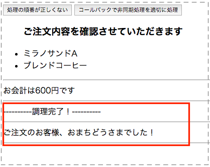
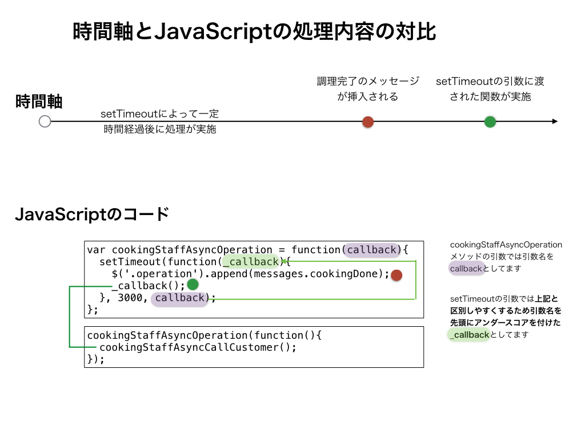

## 非同期処理を考慮する形に書き換える

さきほど非同期処理を考慮しない書き方の時に作ったindex.html、main.jsをそのまま流用しながら一部処理を追加します

### HTMLの修正

```html
<button id="storeAsyncOperation">コールバックで非同期処理を適切に処理</button>
```

という記述を追加します。最終的には以下のようになります。


```html
<html>
<head></head>
<body>
  <button id="storeOperation">処理の順番が正しくない</button>
  <!-- 以下を追加する -->
  <button id="storeAsyncOperation">コールバックで非同期処理を適切に処理</button>
  <div class="customerRequest"></div>

  <div class="operation"></div>
  <script type="text/javascript" src='/node_modules/jquery/dist/jquery.js'></script>
  <script type="text/javascript" src='/js/main.js'></script>
</body>
</html>
```

### JavaScriptの修正

続けて、JavaScriptのファイルも以下内容を追加します


```javascript
var cookingStaffAsyncCallCustomer = function(){
  $('.operation').append(messages.callCustomer);
};
var cookingStaffAsyncOperation = function(callback){
  setTimeout(function(_callback){
    $('.operation').append(messages.cookingDone);
    // 調理完了の後にお客さんを呼び出すために以下コールバック関数を呼ぶ
    _callback();
  }, 3000, callback);
};
var storeAsyncOperation = function(){
  calculate(customerOrderRequest);
  confirmOrderRequest();
  sayTotalPrice();
  cookingStaffAsyncOperation(function(){
    cookingStaffAsyncCallCustomer();
  });
};
$('#storeAsyncOperation').on('click',storeAsyncOperation);
```

最終的には以下のようになります。

```javascript
var customerRequestTotal,
    customerOrderRequest = {
      food:  { jp: 'ミラノサンドA', en: 'milanoA'},
      drink: { jp: 'ブレンドコーヒー', en: 'brendCoffee' }
    },
    messages = {
      confirm: '<ul><h3>ご注文内容を確認させていただきます</h3>' +
        '<li>' + customerOrderRequest.food.jp + '</li>' +
        '<li>' + customerOrderRequest.drink.jp + '</li>' +
        '</ul><hr />',
      callCustomer: 'ご注文のお客様、おまちどうさまでした！<hr />',
      cookingDone: '----------調理完了！----------<hr />'
    };
var calculate = function(){
  var priceList = {
    food:  { milanoA: 400 },
    drink: { brendCoffee: 200 }
  };
  customerRequestTotal = priceList.food[customerOrderRequest.food.en] +
    priceList.drink[customerOrderRequest.drink.en];
};
var sayTotalPrice = function(){
  $('.operation').append('お会計は' + customerRequestTotal + '円です');
  $('.operation').append('<hr />');
};

var confirmOrderRequest = function(){
  $('.customerRequest').append(messages.confirm);
};
var cookingStaffCallCustomer = function(){
  $('.operation').append(messages.callCustomer);
};

var cookingStaffOperation = function(){
  setTimeout(function(){
    $('.operation').append(messages.cookingDone);
  }, 3000);
};
// ここから追加した内容
var cookingStaffAsyncCallCustomer = function(){
  $('.operation').append(messages.callCustomer);
};
var cookingStaffAsyncOperation = function(callback){
  setTimeout(function(_callback){
    $('.operation').append(messages.cookingDone);
    _callback();
  }, 3000, callback);
};
// ここまで追加した内容

var storeOperation = function(){
  calculate(customerOrderRequest);
  confirmOrderRequest();
  sayTotalPrice();
  cookingStaffOperation();
  cookingStaffCallCustomer();
};

// ここから追加した内容
var storeAsyncOperation = function(){
  calculate(customerOrderRequest);
  confirmOrderRequest();
  sayTotalPrice();
  cookingStaffAsyncOperation(function(){
    cookingStaffAsyncCallCustomer();
  });
};
// ここまで追加した内容

$('#storeOperation').on('click',storeOperation);

// ここから追加した内容
$('#storeAsyncOperation').on('click',storeAsyncOperation);
// ここまで追加した内容
```

上記修正して、保存をしてから画面を開くと**コールバックで非同期処理を適切に処理**というボタンが新たに追加されてるかと思いますのでそちらをクリックして実行すると以下のように調理完了のメッセージの後に、お客さんを呼ぶという本来意図した動作になってるかと思います。



### setTimeoutの前後の処理の解説

setTimeoutを使って一定時間経過後に処理を行うようにしてますが、慣れないうちは頭のなかでここの処理イメージが湧きづらいかと思うので念のため図解しておきます




もしも上記のコードのコールバックでもイメージが湧きづらい場合には、一番シンプルな処理を以下記載しておきますので、Webブラウザのconsole画面などで実際に動作確認してみてください

```javascript
var show = function(callback){
  console.log('show start');
  callback();
};
var message = function(str){
  console.log(str);
};
show(function(){ 
  message('showの中身が表示されてからこの値が表示される');
});
// show start
// showの中身が表示されてからこの値が表示される
```
