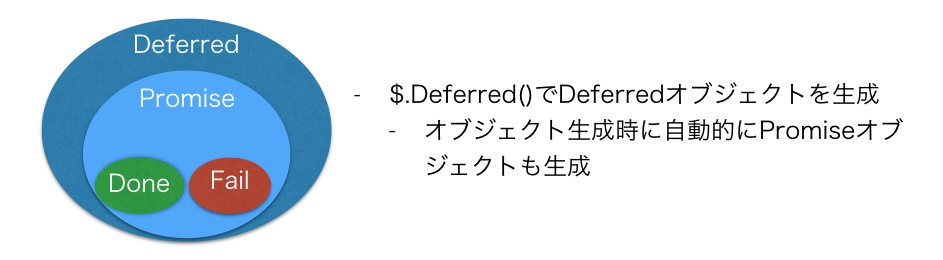

## jQueryのDeferred基本編

jQueryのDeferredという機能を活用することで処理が入れ子状にならないようにすることが出来ます。

jQueryのDeferredについてはYahooデベロッパーネットワークの記事にわかりやすくまとめが書かれてるのでそこから引用します。

> 非同期処理を連結する際、コールバック地獄から解放される（直列処理、並列処理が可能）
> エラー処理をうまく記述できる
> 一連の非同期処理を関数化して再利用しやすくできる
>
> [爆速でわかるjQuery.Deferred超入門](http://techblog.yahoo.co.jp/programming/jquery-deferred/)より引用

実装した非同期処理をjQueryのDeferredを利用した形に書き換えることで、

```javascript
cookingStaffAsyncOperation()
  .done(cookingStaffAsyncCallCustomer)
  .done(anotherOperation)
```

というような処理が入れ子状にならないような書き方にすることができます。

## DeferredとPromiseの用語の整理

[爆速でわかるjQuery.Deferred超入門](http://techblog.yahoo.co.jp/programming/jquery-deferred/)の概念図、ならびに、説明がとてもわかりやすいのでそちらを引用しながら用語の整理をしておきます


### DeferredとPromise 

- 2つともjQuery.Deferredが生成するオブジェクト
- DeferredはPromiseを内包
  - Deferredオブジェクトを生成時に自動的にPromiseオブジェクトも生成される
- DeferredとPromiseは常に1対1で作成される
- Promiseオブジェクトは概念的には以下3つを持っている
  - 状態
  - 状態がresolvedになった時に実行されるコールバック(.done)
  - 状態がrejectedになった時に実行されるコールバック(.fail)



### Deferredオブジェクトと非同期処理

まず概念図をYahooデベロッパーネットワークの記事から引用します。


上記の概念図で非同期に処理されるメソッドをDeferred対応させると書いてますが、対応前のコードと対応後のコードを比較するとイメージが湧くかと思うので以下記載します


#### 対応前のコード

```javascript
var operation = function(callback){ // (1)
  setTimeout(function(_callback){
    $('.operation').append(messages.cookingDone);
    _callback(); // (2)
  }, 3000, callback);
};
```

#### Deferred対応させたコード

```javascript
var operation = function(){  // (3)
  var deferred = new $.Deferred; // (4)
  setTimeout(function(){
    $('.operation').append(messages.cookingDone);
    deferred.resolve(); // (5)
  }, 3000);
  return deferred.promise(); // (6)
};
```

対応前では引数にcallbackという名前で関数を取り処理が終了したら_callback()でコールバック関数を呼び出してました

対応後は、引数にコールバック関数を取らなくなり、その代わりに、メソッド内でjQuery.Deferredオブジェクトを生成しつつ必要な処理を行ってます。

### Deferred対応させたコードの流れ

Deferred対応させたメソッドが２つあった場合に以下のように処理が実行されます。


非同期処理とDeferredのオブジェクトが紐付いてることで、そこのオブジェクトの状態に応じて次の処理が呼ばれるという流れになります。
