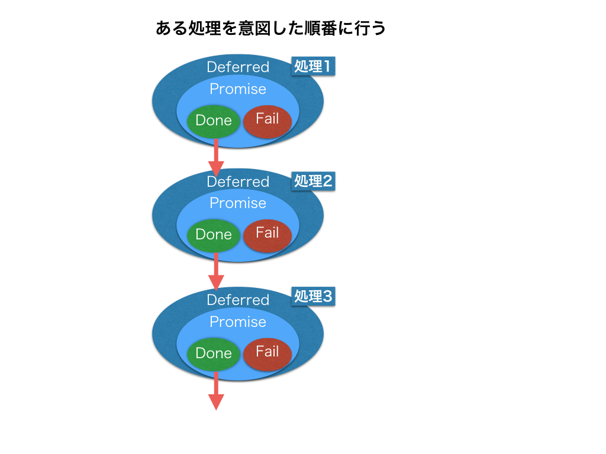
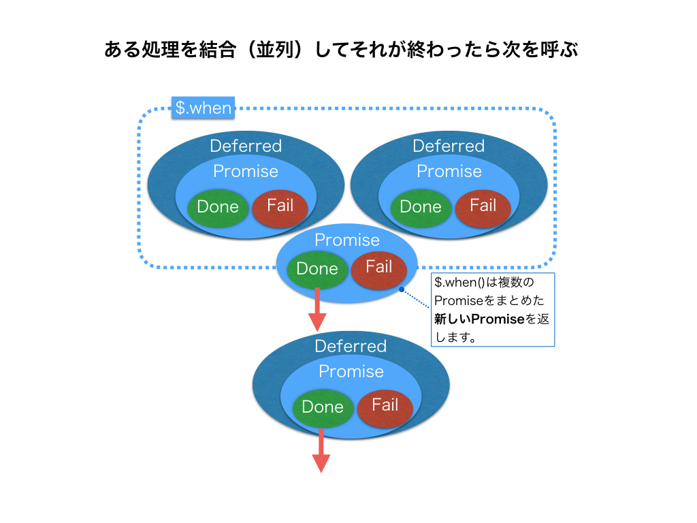

## jQueryのDeferred処理をおさらい

jQueryのDeferredを利用してある処理を意図した順番に行う場合にはこういうイメージになるかと思います。



JavaScriptのコードだと以下の様な形になるかと思います。

```javascript
operaion1()
  .done(operaion2())
  .done(operaion3())
  .done(finalOperation());
```

もしも処理の順場を処理２→処理３→処理１に変更したいという仕様変更があった場合でもjQueryのDeferred化の対応をしたメソッドとして定義しておくことで

```javascript
operaion2()
  .done(operaion3())
  .done(operaion1())
  .done(finalOperation());
```

という形ですぐに対応できます。

ある処理を結合（並列）してそれが終わったら次を呼ぶ処理というのもjQueryのDeferred化の対応をしたメソッドとして定義しつつ$.whenを利用することで対応できます。



JavaScriptのコードだと以下の様な形になるかと思います。

```javascript
$.when(operaion1(), operaion2())
  .done(operaion3())
  .done(finalOperation());
```

当然のことながら、ある処理を結合（並列）をやめて、直列的に処理をしたいという場合には$.whenの処理を変更するだけですみます。

## 全体のまとめ

非同期処理は、処理が一方通行にならないため全体としてみた場合に把握しづらいという特徴があります。

上記点をふまえてコールバック関数を利用することで、処理が意図した順番で呼ばれるようなコードをまずは書いてもらいましたが、コールバック関数で処理をしていくと以下の様なネストが深い（よく言われるコールバック地獄）メンテナンスしづらいコードになってしまいます。

```javascript
cookingStaffAsyncOperation(function(){
  cookingStaffAsyncCallCustomer(function(){
    anotherOperation(function(response){
      if(response){
        // 何かの処理
      } else {
        // 何かの処理
      }
    });
  });
});
```

こういった問題を解決する方法の１つとしてjQueryのDeferredを利用することで対応することが出来ることを紹介しました。

jQueryのDeferredは[結局jQuery.Deferredの何が嬉しいのか分からない、という人向けの小話](http://qiita.com/yuku_t/items/1b8ce6bba133a7eaeb23)の記事を参考に情報まとめておりますので、こちらの記事もチェックすると理解が深まるかと思います。
