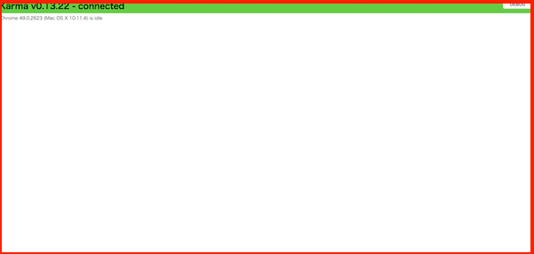

## Jasmineを使ったコードを実際に書く

先ほどでJasmineの構造について説明したのでこれを踏まえて実際にコードを書いてみたいと思います

## はじめに最初に作るツールの仕様について

簡単に仕様についてまとめておきます。Gistクラスを定義するファイル名はひとまずgist.jsとします。

- Gistという名前のクラス
- そのクラスにはfetch()というメソッドが定義されてる
- fetch()メソッドを実行するとあらかじめ設定済のURLからJSONの情報を取得することが出来る

### fetchメソッドについて補足

- サーバーとの通信になるので非同期での処理を想定しており
- 通信処理が正常に完了した場合にdone()というコールバック関数が呼ばれることを想定してます

<div style="page-break-before: always"></div>

### 最終的に実装されるgist.js

gist.jsを利用する側を仮にmain.jsとした場合には

```javascript
var promise,
      gist = new Gist();
promise = gist.fetch();
promise.done(function(response){
  console.log(response)  // (1) 
});
```

という感じにすることでgistの通信処理機能が利用できるようになります。
なお、コード中の（1）の箇所でgistにアクセスした結果が得られてJSON.parse(response)してJSONとして扱えるようになる

## 実際にテストを書きながら作業を進めてみる

実際の仕事でメソッドが定義されてることについてテストを書くのは冗長なので実際には無いかと思うのですが、まずはテストを書くことになれるためにこのテストを書いてみます。

specディレクトリを開いて、新規に**gist_spec.js**という名前のファイルを作ります。

ファイルを作ったら、以下の内容を記述します

```javascript
describe('Gist', function() {
  describe('fetchメソッド', function() {
    it('定義されてる', function(){
    });    
  });
});
```

記述が終わったらターミナルを開いて、以下コマンドを入力して仮想マシンにsshします

```sh
vagrant ssh
```

sshが終わったら以下の要領で /vagrantディレクトリに移動した上で、Karmaを起動するコマンドを入力します。

```sh
cd /vagrant/
./node_modules/karma/bin/karma start ./karma.conf.js
```

Karma v0.13.22 server started at http://localhost:9877/ というメッセージが表示されているのを確認したら、

http://192.168.33.39:9877/

にアクセスすると、以下の様な画面が表示されるはずです


