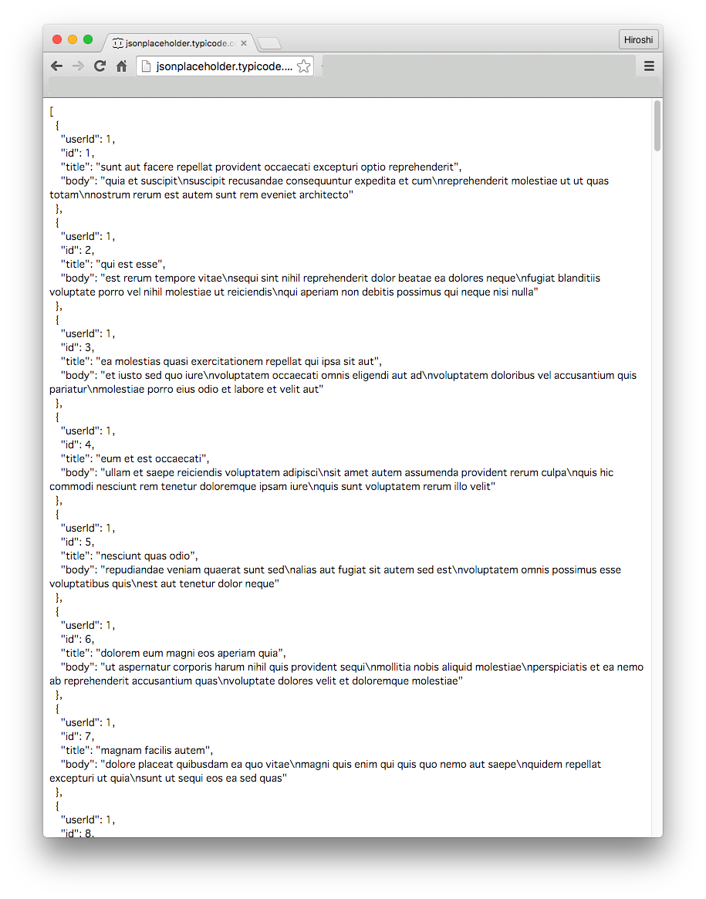

## JSONPlaceholderのAPIを簡単に確認

実際にプログラムを書く前にまずはJSONPlaceholderのAPIを利用することでどんな情報が取得できるかブラウザを通じて動作確認してみたいと思います。

### 投稿（Post）情報一覧を取得する

まずは以下URLにアクセスします。

http://jsonplaceholder.typicode.com/posts

画面上には取得されたJSONがこのような形で表示されるかと思います。

### コメント（Comment)一覧を取得する

上記のURLでは投稿（Post）情報を表現するというリソース一覧を取得するものでしたが、以下URLにアクセスするすとコメント（Comment)一覧を取得することが出来ます。

http://jsonplaceholder.typicode.com/comments

### 特定の投稿情報やコメント情報を取得する

RESTなAPIになってるので、例えば、投稿情報のIDが1を取得したい場合には

http://jsonplaceholder.typicode.com/posts/1

にアクセスすることで取得できます。

また、コメントのIDが1を取得したい場合には

http://jsonplaceholder.typicode.com/comments/1

にアクセスすることで取得することが出来ます。

### 他に利用可能なAPIについて

JSONPlaceholderで定義されてるリソース一覧ですが、上記以外に2016年4月15日時点で以下が利用できるようです。

http://jsonplaceholder.typicode.com/albums
http://jsonplaceholder.typicode.com/photos
http://jsonplaceholder.typicode.com/todos
http://jsonplaceholder.typicode.com/users

JSONPlaceholderのAPIを簡単に確認しましたので、次からJasmineでテストを書きながらJSONPlaceholderのAPIを使ったJavaScriptのプログラムを実装していきます。
